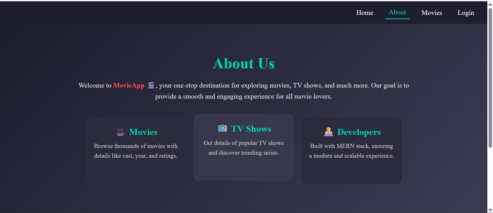
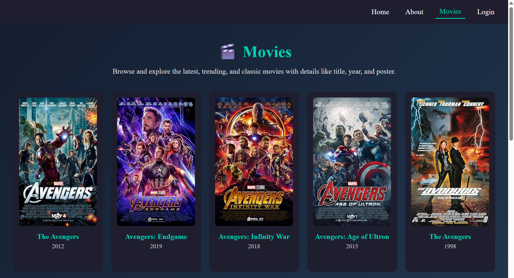
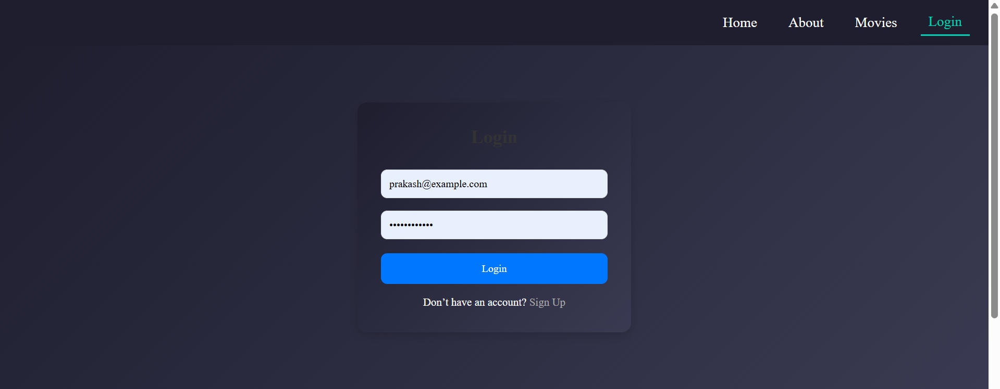
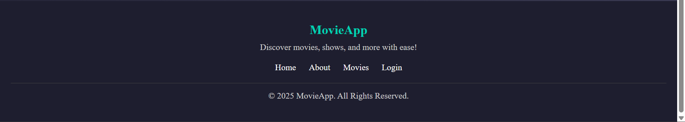

# 🎬 Movies Web Application

A Movies-inspired web application built using **React.js** with a **responsive UI**.  
The app dynamically fetches movies and TV shows using **Axios API integration**, and provides an engaging browsing experience with sections like **Header, Banner, and Movies list**.

---

## 🚀 Features
- 🎥 Movies-style UI with responsive design  
- 📡 API integration using Axios  
- 🖼️ Dynamic Banner showcasing featured movies  
- 📂 Movie sections categorized by genres  
- 💻 Fully responsive for desktop and mobile  

---

## 🛠️ Tech Stack
- **Frontend:** React.js, JavaScript, CSS  
- **API Handling:** Axios  
- **Version Control:** Git & GitHub  

---

## 📸 Screenshots

### Homepage

### About page

### Movies Section

### Login page

### Footer Section

